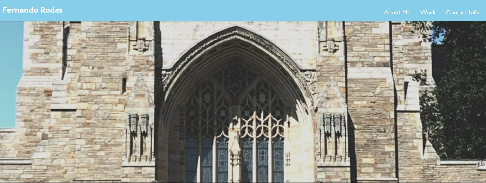
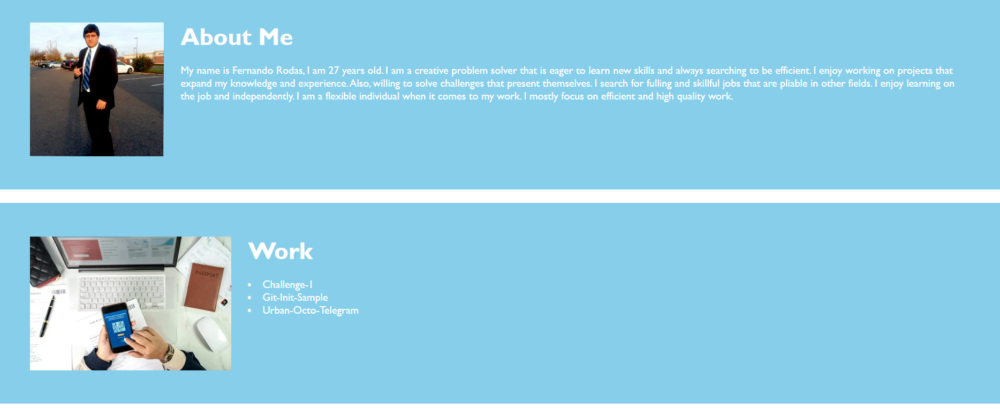

# Challenge-2

## Overview
I created a portfolio of my personal contact with my name, phone number, LinkedIn, and photo. I gave a brief description of my past work with links of my recent work. Also, demonstrated some of my skills by creating this online portfolio. There are three sections: About Me, Work, and Contact Info. The About ME section gives a description of my qualities as a developer and person. The Work section includes clickable links to my Github page where some of my past work can be viewed. My Contact Info section has all my personal information on how to contact me: phone number, email, and LinkedIn. The page has three images beside each section. The links on my Work section have hyper links that will direct the user to my projects. My contact information section has a URL that will direct the user to my LinkedIn profile.  

## see below a screenshot of my web page 

The picture is of my header in my portfolio: 

The picture is of my "About Me & Work" in my portfolio:

The picture is of my "Contact Info" in my portfolio:

## Deployment URL
https://fgrodasmendez1.github.io/Challenge-2/
